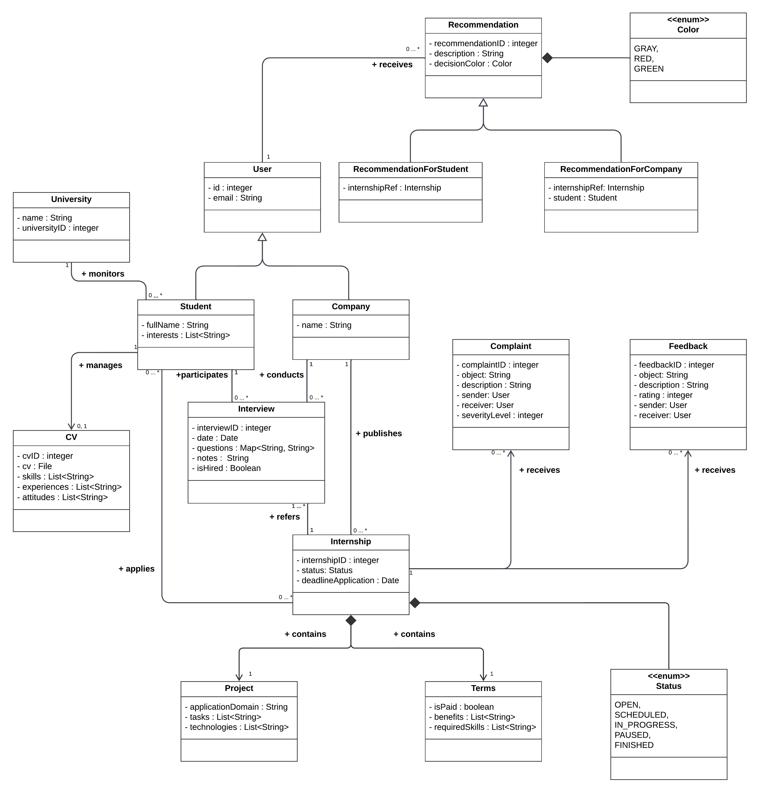

# RASD-DD Project

This repository contains the deliverables for the Students&Companies (S&C) platform, developed for the Software Engineering 2 course.

## Project Summary

**Students&Companies (S&C)** is a platform that matches university students seeking internships with companies offering them. The system supports proactive search, recommendations, selection processes, feedback collection, and monitoring of internships for all stakeholders (students, companies, and universities).

For full assignment details, see `Assignment RDD AY 2024-2025.pdf`.

---

## Main Ambiguous Parts Addressed

The assignment specification left several aspects open to interpretation. In our documentation, we made explicit decisions regarding:

- **Matching & Recommendation Mechanisms:** The assignment does not specify the level of sophistication or algorithms for matching students and internships.
- **Recommendation Triggers & Acceptance:** The process for triggering and accepting recommendations is not detailed.
- **Selection Process:** Steps after a contact is established (e.g., interviews, questionnaires, finalization) are vague.
- **Feedback & Suggestions:** The types and usage of feedback, and how suggestions are generated, are not described.
- **Monitoring & Communication:** The form and workflow for complaints, status updates, and university intervention are unspecified.
- **User Roles & Permissions:** The responsibilities and interactions of students, companies, and universities are not fully defined.
- **Internship Lifecycle:** The stages and transitions of internships are not explicitly described.

All assumptions and design choices made to resolve these ambiguities are documented in the RASD and DD.

---

## UML Domain Class Diagram

Below is the main domain class diagram for the Students&Companies (S&C) platform:

More UML diagrams and detailed models are available in the `uml/RASD_diagrams.pdf` and `uml/DD_diagrams.pdf` documents.

---
## Deliverables

### 1. Requirements Analysis and Specification Document (RASD)

The RASD describes the problem domain, requirements, and specifications using a mix of natural language, UML, and Alloy. It includes:

- **Introduction:** Purpose, scope, definitions, revision history, references, and document structure.
- **Overall Description:** Product perspective, scenarios, domain models, product functions, user characteristics, assumptions, dependencies, and constraints.
- **Specific Requirements:** External interface requirements, functional requirements (use cases, diagrams), performance requirements, design constraints, and software system attributes.
- **Formal Analysis Using Alloy:** Objectives, model description, and validation results.
- **Effort Spent:** Hours worked by each group member.
- **References**

### 2. Design Document (DD)

The DD provides a functional and architectural description of the system, including:

- **Introduction:** Purpose, scope, definitions, revision history, references, and document structure.
- **Architectural Design:** Overview, component view, deployment view, runtime view, component interfaces, architectural styles/patterns, and design decisions.
- **User Interface Design:** Overview and mockups of the system's user interface.
- **Requirements Traceability:** Mapping of RASD requirements to design elements.
- **Implementation, Integration, and Test Plan:** Order of implementation, integration, and testing.
- **Effort Spent:** Hours worked by each group member.
- **References**

---

## Project Files

- `Assignment RDD AY 2024-2025.pdf` – Assignment description
- `uml/DD_diagrams.pdf` – Diagrams referenced in the DD
- `DD.pdf` – Design Document
- `presentation.pdf` – Project presentation slides
- `uml/RASD_diagrams.pdf` – Diagrams referenced in the RASD
- `RASD.pdf` – Requirements Analysis and Specification Document
- `uml/domain_class_diagram.png` – Domain class diagram

---

## Authors

This project was developed by **Rodrigo Almandoz Franco** and **Mattia Brandi**.
